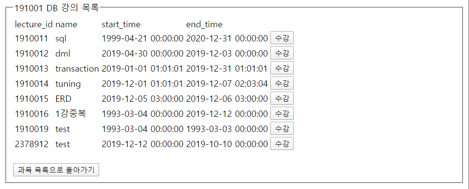

# LMS-System

LMS(학습 관리) 시스템 구축 및 웹 구현

 

### Goal

- LMS(학습 관리) 시스템 구조가 적재된 DB server 구축

  → DB server와 연동된 Web 상에서 LMS 시스템 관리 가능하도록 구현

   

1. 회원 가입 정보, 수강 정보, 문제 은행 등 LMS 시스템 적재된 DB 구축
2. DB server와 연동된 Web 구현

 

### Tech/Framework Used

- Database
  - MySQL
- Web
  - HTML
  - PHP
  - JavaScript

 

### Screenshots

